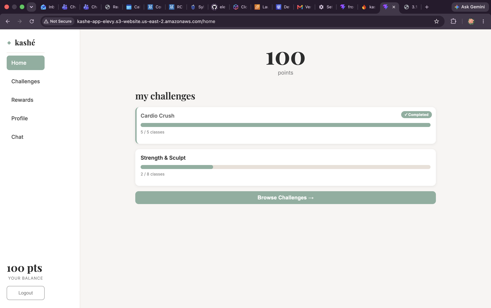
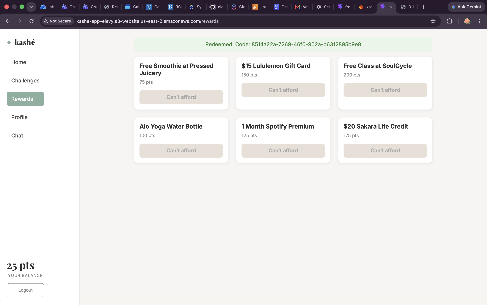
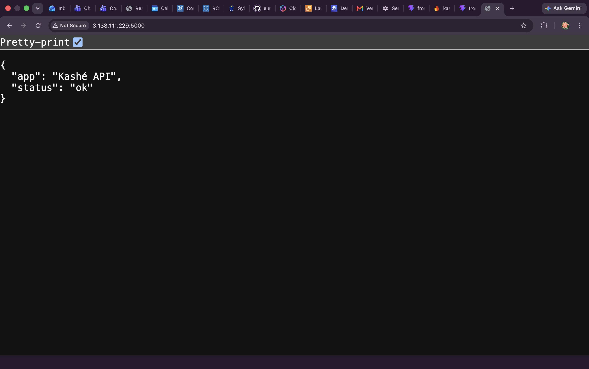
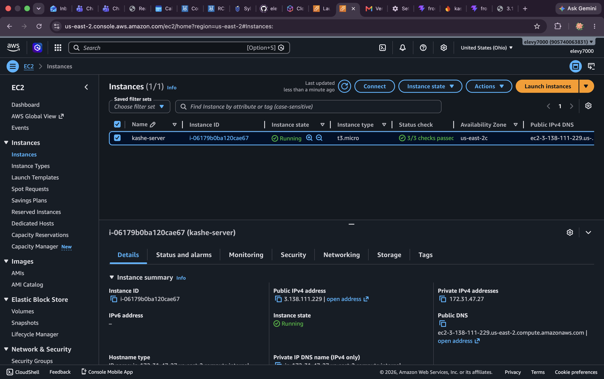
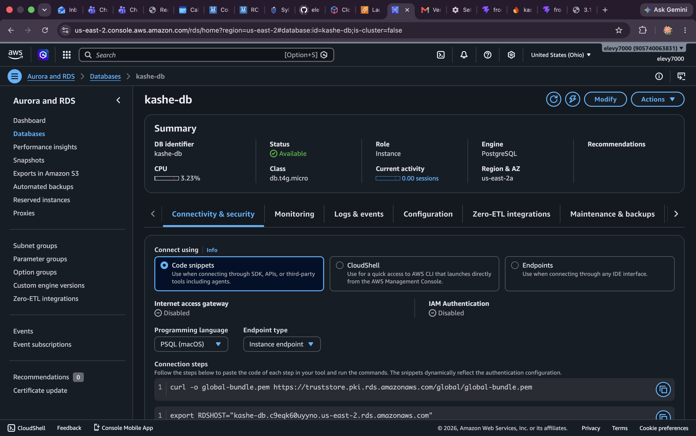
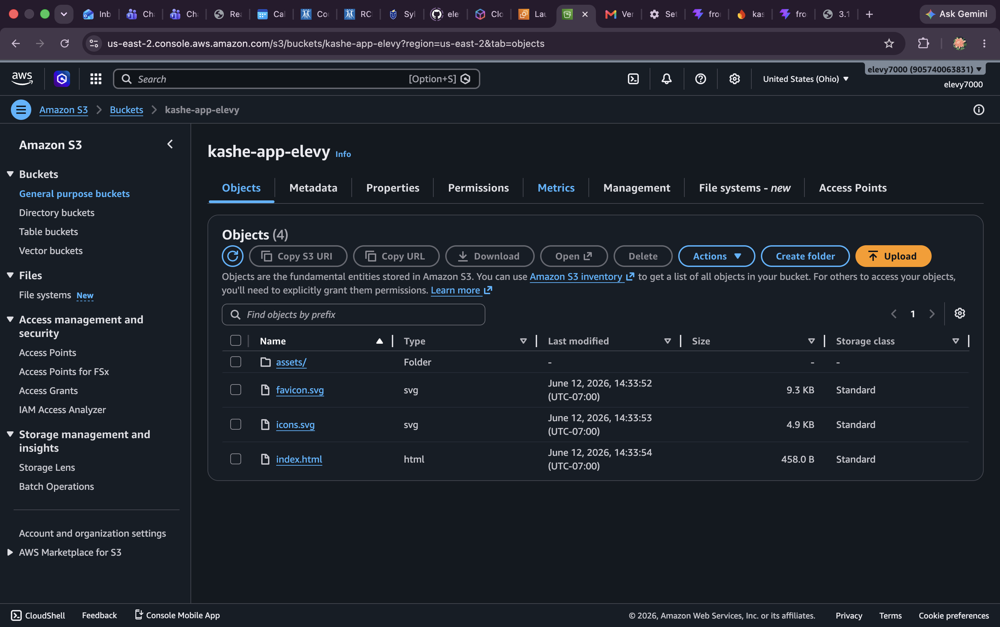

# 💎 Kashé — Fitness Rewards Platform

Kashé is a cross-studio fitness loyalty platform. Users earn points by completing
workout challenges at boutique fitness studios and redeem them for brand-sponsored
rewards — a free smoothie, a Lululemon gift card. Studios get a loyalty program at
zero overhead; sponsors get high-intent product placement; users get rewarded for
showing up.

**Live app:** [http://kashe-app-elevy.s3-website.us-east-2.amazonaws.com](http://kashe-app-elevy.s3-website.us-east-2.amazonaws.com)
**API health check:** [http://3.138.111.229:5000/](http://3.138.111.229:5000/)

---

## Architecture

```
┌─────────────────────────┐
│  React (Vite) frontend  │   hosted on Amazon S3 (static website)
└───────────┬─────────────┘
            │ HTTPS/REST (JSON) + Socket.IO + SSE
┌───────────▼─────────────┐
│   Flask API (gunicorn)  │   hosted on Amazon EC2 (Ubuntu, systemd service)
│  auth · challenges ·    │
│  points · rewards ·     │
│  AI chatbot agent       │
└──┬─────────┬─────────┬──┘
   │ SQL     │ HTTPS   │ HTTPS
┌──▼──────┐ ┌▼────────┐ ┌▼──────────────┐
│ Postgres│ │ Gemini  │ │ Open-Meteo    │
│ on RDS  │ │ API     │ │ weather API   │
└─────────┘ └─────────┘ └───────────────┘
   plus: Firebase Auth (Google sign-in verification)
```

**Three AWS services, two machines:** the React frontend is served from **S3**,
the Flask API runs on **EC2** as a self-restarting systemd service, and all data
lives in **PostgreSQL on RDS**. No part of the system runs locally.

## The AI Agent

The Kashé Coach ("Kai") is a Gemini-powered agent with **12 backend tools** it
can call autonomously based on the conversation:


| Tool                        | What it does                                                                                   |
| --------------------------- | ---------------------------------------------------------------------------------------------- |
| `get_user_balance`          | Live points balance (always `SUM(delta)` over the transaction log)                             |
| `get_user_activity_summary` | Recent activity overview                                                                       |
| `get_user_challenges`       | Active enrollments + progress                                                                  |
| `list_available_challenges` | Challenges open to join                                                                        |
| `enroll_in_challenge`       | Joins a challenge by name — a full CUJ via chat                                                |
| `log_class_for_challenge`   | Logs a class attendance via chat                                                               |
| `get_available_rewards`     | Rewards the user can afford                                                                    |
| `redeem_reward_for_user`    | Redeems a reward and returns the code — via chat                                               |
| `analyze_weekly_pace`       | Is the user on pace to finish before deadlines?                                                |
| `suggest_weekly_plan`       | Builds a weekly class plan                                                                     |
| `get_motivational_context`  | Lifetime stats for encouragement                                                               |
| `get_workout_weather`       | **Calls the external Open-Meteo API** for live weather and advises indoor vs. outdoor training |


Replies stream to the UI over **Server-Sent Events**, and point-balance changes
broadcast in real time over **Socket.IO**.

## Features

- **Auth:** email/password (werkzeug-hashed) with JWT sessions, plus **Google
sign-in** via Firebase (ID tokens verified server-side with firebase-admin)
- **Challenges:** browse, join, track progress with live progress bars
- **Attendance:** manual "Log a Class" (Phase 1), plus a simulated **MindBody
webhook** (`/api/webhook/mindbody`) demonstrating the Phase 2 auto-attendance path
- **Points:** append-only transaction ledger — balance is always derived, never
stored, so it can't drift or corrupt
- **Rewards:** atomic redemption transaction returns a unique `KSH-XXXX` code
- **Chatbot:** the 12-tool agent above — users can complete entire user journeys
(enroll, log a class, redeem) in plain English

## Tech Stack


| Layer         | Technology                                                                               |
| ------------- | ---------------------------------------------------------------------------------------- |
| Frontend      | React 18, Vite, react-router-dom, Socket.IO client                                       |
| Backend       | Python 3, Flask, Flask-JWT-Extended, Flask-SQLAlchemy, Flask-SocketIO, gunicorn (gevent) |
| Database      | PostgreSQL (Amazon RDS) — SQLite for local dev                                           |
| AI            | Google Gemini with agentic function calling                                              |
| External APIs | Open-Meteo (weather), Firebase Auth                                                      |
| Hosting       | AWS: EC2 (API) + RDS (database) + S3 (frontend)                                          |
| CI            | GitHub Actions — pytest suite runs on every push/PR                                      |


## Running Locally

Backend:

```bash
cd backend
python3 -m venv venv && source venv/bin/activate
pip install -r requirements.txt
cp .env.example .env   # fill in GEMINI_API_KEY (SQLite is the default DB)
python seed.py         # creates tables + demo users, challenges, rewards
python app.py          # http://127.0.0.1:5000
```

Frontend:

```bash
cd frontend
npm install
npm run dev            # http://localhost:5173
```

### Environment variables


| Variable         | Purpose                                                 |
| ---------------- | ------------------------------------------------------- |
| `DATABASE_URL`   | Postgres connection string (falls back to local SQLite) |
| `JWT_SECRET_KEY` | Signs login tokens                                      |
| `GEMINI_API_KEY` | Gemini API access for the chatbot agent                 |
| `CORS_ORIGINS`   | Comma-separated allowed frontend origins                |
| `VITE_API_URL`   | (frontend, build-time) API base URL                     |


## Testing

```bash
cd backend && python -m pytest tests/test_api.py -v
```

19 tests cover auth, challenge, points, and reward flows. The same suite runs in
CI via GitHub Actions on every push and pull request.

## Deployment

The API deploys to EC2 with a simple flow: `git pull` → `sudo systemctl restart kashe`. The systemd unit keeps gunicorn running across reboots and crashes. The
frontend is built with `VITE_API_URL=<api-url> npm run build` and the `dist/`
contents are uploaded to the S3 bucket (static website hosting enabled).

## Screenshots

**Live deployed app (served from S3, talking to Flask on EC2):**

****

****

****

**AWS infrastructure:**

****

****

****

****

## Project Documents

- [System Design Document](./docs/kashe-design-doc.pdf) — architecture, CUJs,
sequence diagrams, decisions & tradeoffs
- Built solo by Esther Levy. Phase 2 roadmap: real MindBody integration, studio
admin portal, sponsor dashboard, SES redemption emails, CloudFront + HTTPS.

